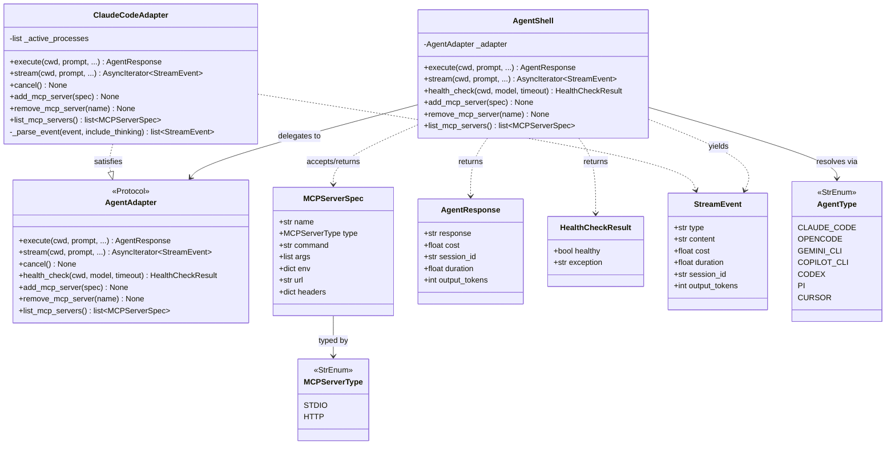

# Agent Shell

A lightweight, async Python package that executes CLI coding agents headlessly and returns output through a unified interface. Each agent's CLI differences are hidden behind a common adapter protocol, so consuming code never changes regardless of which agent is running underneath.

## Architecture



The adapter pattern uses Python's `Protocol` (structural typing) rather than ABC, so adapters satisfy the contract implicitly without inheritance. Each adapter manages its own subprocess lifecycle, translating agent-specific CLI flags and NDJSON output into the shared `StreamEvent`/`AgentResponse` models.

`output_tokens` is a cost measure — the billed output-token count, which **includes reasoning tokens** (billed at the output rate). Each adapter normalises this so the value is consistent across agents (e.g. OpenCode reports reasoning in a sibling field, so its adapter adds it back).

`health_check(cwd, model, timeout)` probes an agent + model combination with a trivial prompt and returns `HealthCheckResult(healthy, exception)`. The verdict is derived from the normalised event stream (healthy = a `result` event with no `error`), not exit codes — which are unreliable, since some CLIs exit 0 on failure. The shared logic lives once in `adapters/health.py`; each adapter delegates to it.

## Supported Agents

- [x] Claude Code
- [x] OpenCode
- [x] Copilot CLI
- [x] Codex
- [x] Pi
- [x] Cursor
- [ ] Gemini CLI

## MCP Server Configuration

`AgentShell` exposes a unified API for registering MCP servers across all supported agents:

```python
from agent_shell import AgentShell
from agent_shell.models.agent import AgentType, MCPServerSpec, MCPServerType

shell = AgentShell(agent_type=AgentType.CLAUDE_CODE)

await shell.add_mcp_server(MCPServerSpec(
    name="forgetful",
    type=MCPServerType.STDIO,
    command="uvx",
    args=["forgetful-ai"],
    env={"FORGETFUL_API_KEY": "..."},
))
```

All adapters write to user-scope configuration:

| Agent | Mechanism | Location |
|-------|-----------|----------|
| Claude Code | `claude mcp add --scope user` subprocess | `~/.claude.json` (managed by CLI) |
| OpenCode | direct JSON file write | `~/.config/opencode/opencode.json` |
| Copilot CLI | direct JSON file write | `~/.copilot/mcp-config.json` |
| Codex | `codex mcp add` subprocess | Codex config |

Adds are idempotent (overwrite existing entries with the same name). Removes warn rather than raise when the named server is not found. Claude Code listing reads the user-scope `mcpServers` entries from `~/.claude.json` directly, avoiding the health checks and human-readable output of `claude mcp list`. MCP is not implemented for Pi or Cursor — all three methods raise `NotImplementedError`. Pi manages capability via `pi install` extensions (which needs investigation before wiring up); Cursor's `mcp` subcommands are login/list/list-tools/enable/disable only (no add/remove — servers are declared in `.cursor/mcp.json`), and `mcp list` reports only `name: status`, not the transport an `MCPServerSpec` needs.

## Test Philosophy

Tests validate real functionality, not code coverage metrics. Three tiers, each with a distinct purpose:

| Tier | Scope | Runs in CI | Real CLI calls |
|------|-------|-----------|----------------|
| **Unit** | Isolated functions (`_parse_event`, adapter resolution, input validation) | Yes | No |
| **Integration** | Full flow through `AgentShell` -> `Adapter` -> parser with mocked subprocess | Yes | No |
| **E2E** | Real CLI agent calls, real API costs | No (local only) | Yes |

Integration tests mirror the E2E tests exactly but substitute a mocked subprocess emitting captured NDJSON fixtures. This means CI validates the entire class interaction chain without credentials or API spend. E2E tests exist as a local smoke test to confirm the real agents still behave as expected.

All tests follow the **AAA pattern** (Arrange, Act, Assert).

```bash
# CI suite (unit + integration)
uv run pytest tests/unit tests/integration -v

# Full suite including E2E (requires agent CLI + credentials)
uv run pytest -v
```

## CI/CD

- **CI**: Runs unit + integration tests on every push and PR
- **Build**: Triggers on `v*` tags, runs tests then builds sdist + wheel artifacts for release
