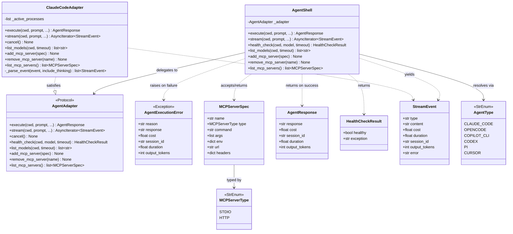

# Agent Shell

A lightweight, async Python package that executes CLI coding agents headlessly and returns output through a unified interface. Each agent's CLI differences are hidden behind a common adapter protocol, so consuming code never changes regardless of which agent is running underneath.

## Architecture


```mermaid
classDiagram
    class AgentShell {
        -AgentAdapter _adapter
        +execute(cwd, prompt, ...) AgentResponse
        +stream(cwd, prompt, ...) AsyncIterator~StreamEvent~
        +health_check(cwd, model, timeout) HealthCheckResult
        +list_models(cwd, timeout) list~str~
        +add_mcp_server(spec) None
        +remove_mcp_server(name) None
        +list_mcp_servers() list~MCPServerSpec~
    }

    class AgentAdapter {
        <<Protocol>>
        +execute(cwd, prompt, ...) AgentResponse
        +stream(cwd, prompt, ...) AsyncIterator~StreamEvent~
        +cancel() None
        +health_check(cwd, model, timeout) HealthCheckResult
        +list_models(cwd, timeout) list~str~
        +add_mcp_server(spec) None
        +remove_mcp_server(name) None
        +list_mcp_servers() list~MCPServerSpec~
    }

    class ClaudeCodeAdapter {
        -list _active_processes
        +execute(cwd, prompt, ...) AgentResponse
        +stream(cwd, prompt, ...) AsyncIterator~StreamEvent~
        +cancel() None
        +list_models(cwd, timeout) list~str~
        +add_mcp_server(spec) None
        +remove_mcp_server(name) None
        +list_mcp_servers() list~MCPServerSpec~
        -_parse_event(event, include_thinking) list~StreamEvent~
    }

    class AgentExecutionError {
        <<Exception>>
        +str reason
        +str response
        +float cost
        +str session_id
        +float duration
        +int output_tokens
    }

    class MCPServerSpec {
        +str name
        +MCPServerType type
        +str command
        +list args
        +dict env
        +str url
        +dict headers
    }

    class MCPServerType {
        <<StrEnum>>
        STDIO
        HTTP
    }

    class AgentResponse {
        +str response
        +float cost
        +str session_id
        +float duration
        +int output_tokens
    }

    class HealthCheckResult {
        +bool healthy
        +str exception
    }

    class StreamEvent {
        +str type
        +str content
        +float cost
        +float duration
        +str session_id
        +int output_tokens
        +str error
    }

    class AgentType {
        <<StrEnum>>
        CLAUDE_CODE
        OPENCODE
        COPILOT_CLI
        CODEX
        PI
        CURSOR
    }

    AgentShell --> AgentAdapter : delegates to
    AgentShell --> AgentType : resolves via
    ClaudeCodeAdapter ..|> AgentAdapter : satisfies
    AgentShell ..> AgentResponse : returns on success
    AgentShell ..> AgentExecutionError : raises on failure
    AgentShell ..> HealthCheckResult : returns
    AgentShell ..> StreamEvent : yields
    AgentShell ..> MCPServerSpec : accepts/returns
    MCPServerSpec --> MCPServerType : typed by
    ClaudeCodeAdapter ..> StreamEvent : parses NDJSON into
```

The adapter pattern uses Python's `Protocol` (structural typing) rather than ABC, so adapters satisfy the contract implicitly without inheritance. Each adapter manages its own subprocess lifecycle, translating agent-specific CLI flags and NDJSON output into the shared `StreamEvent`/`AgentResponse` models.

`output_tokens` is a cost measure — the billed output-token count, which **includes reasoning tokens** (billed at the output rate). Each adapter normalises this so the value is consistent across agents (e.g. OpenCode reports reasoning in a sibling field, so its adapter adds it back).

`health_check(cwd, model, timeout)` probes an agent + model combination with a trivial prompt
and returns `HealthCheckResult(healthy, exception)`. The verdict is derived from the normalised
event stream (healthy = the LAST `result` event says `content == "ok"` and no `error` event
arrived — pi emits one `result` per agent loop, and its auto-retry runs more than one), not exit
codes — which are unreliable, since some CLIs exit 0 on failure. `execute()` judges a run by the
same rule and raises `AgentExecutionError` when it fails, carrying whatever partial
response/cost/session/token data the run produced. The success/failure verdict lives once in
`adapters/outcome.py`, shared by both surfaces so they report identical reasons for the same
stream; `adapters/health.py` wraps it for the health probe, and `adapters/response.py` wraps it
for `execute()`'s stream-to-`AgentResponse` collection (used by every adapter — each `execute()`
is a single delegating call into it).

`list_models(cwd, timeout)` asks the selected CLI for its current account/workspace-aware model
catalog and returns exact `list[str]` selectors that can be passed unchanged to `execute()` or
`stream()`. It sends no inference prompt, imports no harness SDK, invokes no separate refresh
command, and never substitutes a static catalog. "Available" means advertised as selectable; use
`health_check(model=...)` when actual execution must be proven.

## Supported Agents

- [x] Claude Code
- [x] OpenCode
- [x] Copilot CLI
- [x] Codex
- [x] Pi
- [x] Cursor
- [x] Grok

## MCP Server Configuration

`AgentShell` exposes a unified API for registering MCP servers across all supported agents:

```python
from agent_shell.shell import AgentShell
from agent_shell.models.agent import AgentType, MCPServerSpec, MCPServerType

shell = AgentShell(agent_type=AgentType.CLAUDE_CODE)

await shell.add_mcp_server(MCPServerSpec(
    name="forgetful",
    type=MCPServerType.STDIO,
    command="uvx",
    args=["forgetful-ai"],
    env={"FORGETFUL_API_KEY": "..."},
))
```

All adapters write to user-scope configuration:

| Agent | Mechanism | Location |
|-------|-----------|----------|
| Claude Code | `claude mcp add --scope user` subprocess | `~/.claude.json` (managed by CLI) |
| OpenCode | direct JSON file write | `~/.config/opencode/opencode.json` |
| Copilot CLI | direct JSON file write | `~/.copilot/mcp-config.json` |
| Codex | `codex mcp add` subprocess | Codex config |
| Cursor | direct JSON file write | `~/.cursor/mcp.json` |
| Grok | `grok mcp add --scope user` subprocess | `~/.grok/config.toml` (managed by CLI) |

Adds are idempotent (update existing entries with the same name). Cursor preserves native fields
that `MCPServerSpec` cannot represent when an update keeps the same transport, and writes its file
atomically with user-only permissions. Removes warn rather than raise when the named server is not
found. Claude Code listing reads the user-scope `mcpServers`
entries from `~/.claude.json` directly, avoiding the health checks and human-readable output of
`claude mcp list`. Cursor manages user-scope MCP entries directly in `~/.cursor/mcp.json` because
its `mcp` subcommands have no add/remove commands. Grok listing reads user-scope `mcp_servers`
entries from `~/.grok/config.toml` directly for the same reason. Pi's MCP add/remove/list methods
raise `NotImplementedError`. Pi manages capability via `pi install` extensions, which needs
investigation before wiring up.

## Test Philosophy

Tests validate real functionality, not code coverage metrics. Three tiers, each with a distinct purpose:

| Tier | Scope | Runs in CI | Real CLI calls |
|------|-------|-----------|----------------|
| **Unit** | Isolated functions (`_parse_event`, adapter resolution, input validation) | Yes | No |
| **Integration** | Full flow through `AgentShell` -> `Adapter` -> parser with mocked subprocess | Yes | No |
| **E2E** | Real CLI calls; usually real API costs | No (local only) | Yes |

The model-discovery E2E test is the exception: it calls all seven real CLIs but only reads
metadata, so it sends no inference request and incurs no model-token cost.

Integration tests mirror the E2E tests but substitute mocked subprocesses emitting captured CLI
output fixtures. This lets CI validate the full class interaction chain without credentials or API
spend. E2E tests remain local smoke tests for the real agents.

All tests follow the **AAA pattern** (Arrange, Act, Assert).

```bash
# CI suite (unit + integration)
uv run pytest tests/unit tests/integration -v

# Full suite including E2E (requires agent CLI + credentials)
uv run pytest -v
```

## CI/CD

- **CI**: Runs unit + integration tests on every push and PR
- **Build**: Triggers on `v*` tags, runs tests then builds sdist + wheel artifacts for release
