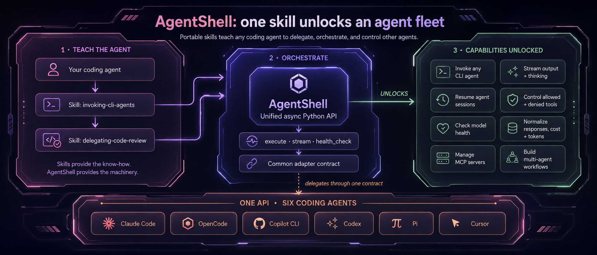

# Agent Shell
Agent Shell is a light weight abstraction for executing a cli coding agent headlessly
and returning the output that can be used programatically as a unified contract

## Features

- **One unified contract** — the same `execute`, `stream`, `health_check`, and
  `list_models` API across every agent; swap the backend without changing consuming code.
- **Seven CLI agents** — Claude Code, OpenCode, Copilot CLI, Codex, Pi, Cursor, and Grok
  behind a common adapter protocol.
- **Execute or stream** — get one `AgentResponse` (raises `AgentExecutionError` on a failed run),
  or async-iterate normalized `StreamEvent`s with optional thinking/reasoning.
- **Session resumption** — continue any conversation by passing back its `session_id`.
- **Normalized cost & tokens** — consistent `cost` and `output_tokens` (reasoning included)
  regardless of how each CLI reports them.
- **Model discovery** — retrieve the exact account/workspace-aware model strings accepted by
  each CLI, without inference calls, SDK dependencies, or static catalogs.
- **Health checks** — confirm an agent + model combination actually works before you rely on
  it, read from the event stream rather than unreliable exit codes.
- **Portable tool control** — one canonical allow/deny vocabulary
  (`bash, edit, read, web_search, web_fetch`) translated to each CLI's own tool names.
- **Unified MCP management** — register, remove, and list MCP servers across agents through a
  single API.
- **Async & dependency-free** — pure `asyncio`, zero runtime dependencies, Python 3.12+.

## Installation

```bash
uv add agent-shell-py
```

or with pip:

```bash
pip install agent-shell-py
```

## Agent skills



The repository includes reusable skills that teach coding agents how to use AgentShell:

- `invoking-cli-agents` — invoke, stream, resume, and restrict CLI agents.
- `delegating-code-review` — delegate an independent code review through AgentShell.

Install them interactively with the Vercel Skills CLI:

```bash
npx skills add ScottRBK/agent-shell
```

Or install both skills globally for every coding agent supported by AgentShell:

```bash
npx skills add ScottRBK/agent-shell --global \
  --skill '*' \
  --agent claude-code opencode github-copilot codex pi cursor grok \
  --yes
```

Install only the core AgentShell skill with:

```bash
npx skills add ScottRBK/agent-shell --skill invoking-cli-agents
```

The skills provide agent instructions. Install `agent-shell-py` and the chosen coding-agent CLIs
separately.

## Examples

### Execute

```python
from agent_shell.shell import AgentShell
from agent_shell.models.agent import AgentType

shell = AgentShell(agent_type=AgentType.CLAUDE_CODE)

response = await shell.execute(
    cwd="/path/to/project",
    prompt="Can you tell me about this project?",
    allowed_tools=["Read", "Glob", "Grep"],
    model="sonnet",
)

print(response.response)
print(f"Cost: ${response.cost:.4f}")
print(f"Output tokens: {response.output_tokens}")  # billed output, reasoning included
print(f"Session: {response.session_id}")

# Resume the conversation using the session_id
follow_up = await shell.execute(
    cwd="/path/to/project",
    prompt="Now refactor the auth module based on your findings",
    allowed_tools=["Read", "Edit", "Bash"],
    model="sonnet",
    session_id=response.session_id,
)
```

> `output_tokens` is a cost measure: the billed output-token count, which **includes reasoning
> tokens** (they are billed at the output rate). It is reported consistently across all adapters.

### Failure handling

`execute()` raises `AgentExecutionError` instead of returning when a run failed — an `error`
event was emitted, the terminal `result` had `content == "error"`, or no terminal `result`
arrived at all. `str(e)` is the bare reason; the exception also carries whatever partial
`response`/`cost`/`session_id`/`duration`/`output_tokens` the run produced before failing.

```python
from agent_shell.models.agent import AgentExecutionError

try:
    response = await shell.execute(cwd="/path/to/project", prompt="Fix the failing test")
except AgentExecutionError as e:
    print(f"run failed: {e}")   # e.g. "500 model name=qwen3.6-27b-8Q failed to load"
```

### Stream

```python
from agent_shell.shell import AgentShell
from agent_shell.models.agent import AgentType

shell = AgentShell(agent_type=AgentType.CLAUDE_CODE)

async for event in shell.stream(
    cwd="/path/to/project",
    prompt="Refactor the auth module",
    allowed_tools=["Read", "Edit", "Bash"],
    model="sonnet",
    effort="high",
    include_thinking=True,
):
    if event.type == "system":
        print(f"Session: {event.session_id}")
    else:
        print(f"[{event.type}] {event.content}")
```

### Model discovery

Ask the selected CLI which model strings it currently advertises, then pass one back
unchanged. Discovery sends no inference prompt and has no model-token cost.

```python
shell = AgentShell(agent_type=AgentType.CLAUDE_CODE)

models = await shell.list_models(cwd="/path/to/project")
selected_model = models[0]

response = await shell.execute(
    cwd="/path/to/project",
    prompt="Review this project",
    model=selected_model,
)
```

"Available" means advertised as selectable for the current harness, account, and workspace.
It does not prove quota, entitlement, credentials, or provider health. The harness's order and
aliases such as `auto` and `default` are preserved. A genuine empty catalog returns `[]`;
discovery failures are raised instead of being mistaken for an empty catalog.

See the
[agent parameter comparison](docs/development/agent_parameter_comparison.md#model-discovery)
for each harness's underlying discovery mechanism.

### Health check

Verify an agent + model combination actually works before relying on it. It sends a
trivial prompt and reports whether a real response came back — catching bad model names,
missing credentials, and billing/quota failures. Exit codes alone are unreliable (some
CLIs exit 0 on failure), so the verdict is read from the normalized event stream.

```python
shell = AgentShell(agent_type=AgentType.CLAUDE_CODE)

result = await shell.health_check(cwd="/path/to/project", model="haiku")
if not result.healthy:
    print(f"unavailable: {result.exception}")
```

### Restricting tools (`disallowed_tools`)

Pass a deny-list of tools that the agent must not use. Use the canonical vocabulary
`{bash, edit, read, web_search, web_fetch}` and Agent Shell translates it to each CLI's
own tool names — callers don't need to know the per-harness vocabulary:

```python
shell = AgentShell(agent_type=AgentType.CLAUDE_CODE)

response = await shell.execute(
    cwd="/path/to/project",
    prompt="Audit this code but don't run anything or touch the network",
    disallowed_tools=["bash", "web_search", "web_fetch"],
)
```

- `edit` covers write/edit/notebook-edit (it fans out on harnesses that split them).
- Any name outside the canonical set passes through **verbatim** (e.g. an MCP tool
  `mcp__server__tool`, or a harness-specific name like `Write`, or Copilot's `view`).
- Deny takes precedence over auto-approve on every backend that supports it.
- Where a backend cannot enforce a deny, the adapter emits a `UserWarning` listing the
  ignored tools rather than failing silently. Coverage varies: Claude, OpenCode, and Grok
  enforce all five canonical names; Copilot enforces only `bash`/`edit` canonically (use a
  verbatim name for its other tools); Codex can only deny `web_search`; Cursor cannot
  enforce any per-call deny (its tool policy lives in `.cursor/cli.json`).
- Denying `edit` or `read` is **best-effort**: a model can still modify or read files through
  the shell, so also deny `bash` when you need a hard file boundary.

### OpenCode

```python
from agent_shell.shell import AgentShell
from agent_shell.models.agent import AgentType

shell = AgentShell(agent_type=AgentType.OPENCODE)

response = await shell.execute(
    cwd="/path/to/project",
    prompt="Can you tell me about this project?",
    model="anthropic/claude-sonnet-4-5",
)

print(response.response)
print(f"Session: {response.session_id}")

# Resume the conversation using the session_id
follow_up = await shell.execute(
    cwd="/path/to/project",
    prompt="Now refactor the auth module based on your findings",
    model="anthropic/claude-sonnet-4-5",
    session_id=response.session_id,
)
```

> **Note:** For OpenCode, `allowed_tools` and `effort` are **ignored** — the adapter maps
> neither to a CLI flag nor to `opencode.json`. To restrict an OpenCode agent, use
> `disallowed_tools` (see [Restricting tools](#restricting-tools-disallowed_tools)): it is
> enforced via a per-run `OPENCODE_PERMISSION` environment variable and holds even under
> auto-approve. Keep `auto_approve=True` (the default) — with `auto_approve=False`,
> `opencode run` auto-*rejects* permission prompts non-interactively and can silently abort the run.

### Cursor

```python
from agent_shell.shell import AgentShell
from agent_shell.models.agent import AgentType

shell = AgentShell(agent_type=AgentType.CURSOR)

response = await shell.execute(
    cwd="/path/to/project",
    prompt="Can you tell me about this project?",
)

print(response.response)
print(f"Session: {response.session_id}")
```

> **Note:** Cursor runs headlessly via `cursor-agent --print --output-format stream-json` and
> **requires** workspace trust, which the adapter always passes (`--trust`). With
> `auto_approve=True` (the default) it also passes `--force` so tools auto-run; otherwise
> tools are auto-*rejected* but the run still completes. `allowed_tools`, `effort`, and
> `disallowed_tools` are **ignored** — Cursor exposes no per-call tool policy or effort flag
> (tool policy lives in `.cursor/cli.json`), so each emits a `UserWarning`. On a Free plan
> only `model=None`/`"auto"` works. MCP servers are declared in `.cursor/mcp.json`; the
> `add`/`remove`/`list` MCP methods raise `NotImplementedError`.

### Grok

```python
from agent_shell.shell import AgentShell
from agent_shell.models.agent import AgentType

shell = AgentShell(agent_type=AgentType.GROK)

response = await shell.execute(
    cwd="/path/to/project",
    prompt="Can you tell me about this project?",
    model="grok-4.5",
)

print(response.response)
print(f"Session: {response.session_id}")
print(f"Cost: ${response.cost:.4f}")
```

> **Note:** Grok runs headlessly via `grok -p --output-format streaming-messages-json`
> (full assistant blocks — not token-delta `streaming-json`, which would break
> newline-joined text collection). With `auto_approve=True` (the default) the adapter
> passes `--always-approve`. `effort` maps to `--reasoning-effort`, `allowed_tools` to
> `--tools`, and `disallowed_tools` to `--disallowed-tools` (canonical `bash` maps to
> `run_terminal_cmd` — the working deny id, not init.tools' `run_terminal_command`).
> The terminal `result` event carries cost (may be `0` on some auth paths), duration, and
> raw `usage.output_tokens` (reasoning is already inside that figure when reported).
> MCP add/remove/list are supported via `grok mcp` with **user scope only**
> (`~/.grok/config.toml`).

## MCP Servers

Register MCP servers for any supported agent through a unified API. All adapters use user-scope configuration so registrations persist across the agent's `execute`/`stream` calls.

```python
from agent_shell.shell import AgentShell
from agent_shell.models.agent import AgentType, MCPServerSpec, MCPServerType

shell = AgentShell(agent_type=AgentType.CLAUDE_CODE)

# Register a stdio MCP server (e.g. forgetful) before running an eval
await shell.add_mcp_server(MCPServerSpec(
    name="forgetful",
    type=MCPServerType.STDIO,
    command="uvx",
    args=["forgetful-ai"],
    env={"FORGETFUL_API_KEY": "..."},
))

response = await shell.execute(
    cwd="/path/to/project",
    prompt="Recall any prior decisions about the auth module",
)

# Optional cleanup
await shell.remove_mcp_server("forgetful")
```

For HTTP transport, pass `url` and `headers` instead of `command`/`args`/`env`:

```python
await shell.add_mcp_server(MCPServerSpec(
    name="remote",
    type=MCPServerType.HTTP,
    url="https://example.com/mcp",
    headers={"Authorization": "Bearer ..."},
))
```

`add_mcp_server` overwrites an existing server with the same name. `remove_mcp_server` warns rather than raises when the named server is not found. `list_mcp_servers()` works for Claude Code, OpenCode, Copilot CLI, Codex, and Grok. Claude Code reads user-scope entries directly from `~/.claude.json`, and Grok from `~/.grok/config.toml`, so listing does not launch configured servers for health checks. MCP is not supported for Pi or Cursor — neither CLI exposes an add/remove subcommand, so all three MCP methods raise `NotImplementedError`.

## Logging

Agent Shell uses Python's standard `logging` module. Configure the `agent_shell` logger to capture tool calls, session IDs, costs, and errors:

```python
import logging

logging.getLogger("agent_shell").setLevel(logging.INFO)
logging.getLogger("agent_shell").addHandler(logging.StreamHandler())
```

Set to `DEBUG` for raw JSON events and full command arguments.
