# Architecture class diagram

```mermaid
classDiagram
    direction TB
    class shell_AgentShell["AgentShell"] {
        -_adapter: AgentAdapter
        +execution_host: ExecutionHost
        +isolation_policy: IsolationPolicy
        +open_interactive(cwd: str, ...) InteractiveSession
        +execute(cwd: str, prompt: str, ...) AgentResponse
        +stream(cwd: str, prompt: str, ...) AsyncIterator~StreamEvent~
        +health_check(cwd: str, model: Optional~str~, ...) HealthCheckResult
        +list_models(cwd: str, timeout: float) list~str~
        +add_mcp_server(mcp_server: MCPServerSpec) None
        +remove_mcp_server(mcp_server_name: str) None
        +list_mcp_servers() list~MCPServerSpec~
        +add_package(package: PackageSpec, timeout: float) None
        +list_packages() list~PackageSpec~
        +remove_package(source: str, timeout: float) None
    }

    class protocol_AgentAdapter["AgentAdapter"] {
        <<Protocol>>
        +execute(cwd: str, prompt: str, ...) AgentResponse
        +stream(cwd: str, prompt: str, ...) AsyncIterator~StreamEvent~
        +cancel() None
        +health_check(cwd: str, model: Optional~str~, ...) HealthCheckResult
        +list_models(cwd: str, timeout: float) list~str~
        +add_mcp_server(mcp_server: MCPServerSpec) None
        +remove_mcp_server(mcp_server_name: str) None
        +list_mcp_servers() list~MCPServerSpec~
        +add_package(package: PackageSpec, timeout: float) None
        +list_packages() list~PackageSpec~
        +remove_package(source: str, timeout: float) None
    }

    class claude_ClaudeCodeAdapter["ClaudeCodeAdapter"] {
        -_active_processes: list~RunHandle~
        -_execution_host: ExecutionHost
        -_isolation_policy: IsolationPolicy
        +prepare_interactive(directory: Path, ...) InteractiveLaunch
        +parse_interactive_event(event: dict) list~StreamEvent~
        +execute(cwd: str, prompt: str, ...) AgentResponse
        +stream(cwd: str, prompt: str, ...) AsyncIterator~StreamEvent~
        +cancel() None
        +list_models(cwd: str, timeout: float) list~str~
        +add_mcp_server(mcp_server: MCPServerSpec) None
        +remove_mcp_server(mcp_server_name: str) None
        +list_mcp_servers() list~MCPServerSpec~
        -_parse_event(event: dict, include_thinking: bool) list~StreamEvent~
    }

    class models_AgentExecutionError["AgentExecutionError"] {
        <<Exception>>
        +reason: str
        +response: str
        +cost: float
        +session_id: Optional~str~
        +duration: float
        +output_tokens: int
        +returncode: Optional~int~
        +signal: Optional~int~
    }

    class models_PackageSpec["PackageSpec"] {
        <<dataclass>>
        +source: str
    }

    class models_MCPServerSpec["MCPServerSpec"] {
        <<dataclass>>
        +name: str
        +type: MCPServerType
        +command: Optional~str~
        +args: list~str~
        +env: StringMap
        +url: Optional~str~
        +headers: StringMap
    }

    class models_MCPServerType["MCPServerType"] {
        <<StrEnum>>
        STDIO
        HTTP
    }

    class models_AgentResponse["AgentResponse"] {
        <<dataclass>>
        +response: str
        +cost: float
        +session_id: Optional~str~
        +duration: float
        +output_tokens: int
    }

    class models_HealthCheckResult["HealthCheckResult"] {
        <<dataclass>>
        +healthy: bool
        +exception: Optional~str~
    }

    class models_StreamEvent["StreamEvent"] {
        <<dataclass>>
        +type: str
        +content: str
        +cost: float
        +duration: float
        +session_id: Optional~str~
        +output_tokens: int
        +error: Optional~str~
        +returncode: Optional~int~
        +signal: Optional~int~
    }

    class execution_ExecutionHost["ExecutionHost"] {
        <<Protocol>>
        +launch(command: list~str~, cwd: str, ...) RunHandle
    }

    class execution_NativeExecutionHost["NativeExecutionHost"] {
        +launch(command: list~str~, cwd: str, ...) NativeRunHandle
    }

    class herdr_HerdrExecutionHost["HerdrExecutionHost"] {
        <<experimental>>
        +launch(command: list~str~, cwd: str, ...) RunHandle
    }

    class tmux_TmuxExecutionHost["TmuxExecutionHost"] {
        <<experimental>>
        +launch(command: list~str~, cwd: str, ...) RunHandle
        +launch_interactive(command: list~str~, cwd: str, ...) TmuxTerminalSession
    }

    class window_TerminalWindowExecutionHost["TerminalWindowExecutionHost"] {
        <<experimental>>
        +launch(command: list~str~, cwd: str, ...) TerminalWindowRunHandle
    }

    class interactive_InteractiveAdapter["InteractiveAdapter"] {
        <<Protocol>>
        +prepare_interactive(directory: Path, ...) InteractiveLaunch
    }

    class interactive_InteractiveLaunch["InteractiveLaunch"] {
        <<dataclass>>
        +command: list~str~
        +parse_event: EventParser
        +capabilities: frozenset~str~
        +env: Optional~StringMap~
        +event_path: Optional~EventPath~
        +event_offset: int
    }

    class interactive_InteractiveExecutionHost["InteractiveExecutionHost"] {
        <<Protocol>>
        +launch_interactive(command: list~str~, cwd: str, ...) InteractiveTerminal
    }

    class interactive_InteractiveTerminal["InteractiveTerminal"] {
        <<Protocol>>
        +closed: bool
        +returncode: Optional~int~
        +capture_screen() str
        +send_text(text: str, submit: bool) None
        +send_key(key: str) None
        +resize(columns: int, rows: int) None
        +wait() int
        +close() None
    }

    class terminal_TmuxTerminalSession["TmuxTerminalSession"]

    class interactive_InteractiveSession["InteractiveSession"] {
        <<experimental>>
        +terminal: InteractiveTerminal
        +capabilities: frozenset~str~
        +events() AsyncIterator~StreamEvent~
        +close() None
        +\_\_aenter\_\_() InteractiveSession
        +\_\_aexit\_\_(...) None
    }

    class window_TerminalWindowRunHandle["TerminalWindowRunHandle"]

    class execution_PreparedLaunch["PreparedLaunch"] {
        <<dataclass>>
        +command: list~str~
        +env: Optional~StringMap~
        +pass_fds: IntTuple
        +reported_status_fd: Optional~int~
        +close_after_spawn: IntTuple
        +spawned() None
        +failed() None
    }

    class execution_IsolationPolicy["IsolationPolicy"] {
        <<Protocol>>
        +prepare(command: list~str~, env: Optional~StringMap~) PreparedLaunch
    }

    class execution_NoIsolation["NoIsolation"]
    class execution_LinuxPidNamespaceIsolation["LinuxPidNamespaceIsolation"]

    class execution_RunHandle["RunHandle"] {
        <<Protocol>>
        +pid: int
        +returncode: Optional~int~
        +wait() int
        +communicate(input: Optional~bytes~) BytePair
        +cancel() None
        +release() None
    }

    class execution_NativeRunHandle["NativeRunHandle"]

    class models_AgentType["AgentType"] {
        <<StrEnum>>
        CLAUDE_CODE
        OPENCODE
        COPILOT_CLI
        CODEX
        PI
        CURSOR
        GROK
    }

    claude_ClaudeCodeAdapter --> execution_ExecutionHost : holds
    claude_ClaudeCodeAdapter --> execution_IsolationPolicy : holds
    claude_ClaudeCodeAdapter --> execution_RunHandle : tracks active runs
    execution_ExecutionHost ..> execution_RunHandle : returns
    execution_ExecutionHost ..> execution_IsolationPolicy : accepts
    execution_IsolationPolicy ..> execution_PreparedLaunch : returns
    execution_NativeExecutionHost ..> execution_PreparedLaunch : uses
    window_TerminalWindowExecutionHost ..> window_TerminalWindowRunHandle : creates
    window_TerminalWindowRunHandle ..|> execution_RunHandle : satisfies
    shell_AgentShell --> protocol_AgentAdapter : holds
    shell_AgentShell --> execution_ExecutionHost : holds
    shell_AgentShell --> execution_IsolationPolicy : holds
    execution_NativeExecutionHost ..|> execution_ExecutionHost : satisfies
    herdr_HerdrExecutionHost ..|> execution_ExecutionHost : satisfies
    tmux_TmuxExecutionHost ..|> execution_ExecutionHost : satisfies
    window_TerminalWindowExecutionHost ..|> execution_ExecutionHost : satisfies
    execution_NativeExecutionHost ..> execution_NativeRunHandle : creates
    execution_NativeRunHandle ..|> execution_RunHandle : satisfies
    execution_NoIsolation ..|> execution_IsolationPolicy : satisfies
    execution_LinuxPidNamespaceIsolation ..|> execution_IsolationPolicy : satisfies
    shell_AgentShell ..> models_AgentType : resolves via
    claude_ClaudeCodeAdapter ..|> protocol_AgentAdapter : satisfies
    shell_AgentShell ..> models_AgentResponse : returns on success
    shell_AgentShell ..> models_AgentExecutionError : raises on failure
    shell_AgentShell ..> models_HealthCheckResult : returns
    shell_AgentShell ..> models_StreamEvent : yields
    shell_AgentShell ..> models_MCPServerSpec : accepts/returns
    shell_AgentShell ..> models_PackageSpec : accepts/returns
    models_MCPServerSpec --> models_MCPServerType : typed by
    claude_ClaudeCodeAdapter ..> models_StreamEvent : parses NDJSON into
    shell_AgentShell ..> interactive_InteractiveAdapter : requires
    shell_AgentShell ..> interactive_InteractiveExecutionHost : requires
    shell_AgentShell ..> interactive_InteractiveSession : returns
    claude_ClaudeCodeAdapter ..|> interactive_InteractiveAdapter : satisfies
    interactive_InteractiveAdapter ..> interactive_InteractiveLaunch : prepares
    interactive_InteractiveLaunch ..> models_StreamEvent : parser produces
    tmux_TmuxExecutionHost ..|> interactive_InteractiveExecutionHost : satisfies
    interactive_InteractiveExecutionHost ..> interactive_InteractiveTerminal : launches
    interactive_InteractiveExecutionHost ..> execution_IsolationPolicy : accepts
    tmux_TmuxExecutionHost ..> terminal_TmuxTerminalSession : creates
    terminal_TmuxTerminalSession ..|> interactive_InteractiveTerminal : satisfies
    interactive_InteractiveSession --> interactive_InteractiveTerminal : owns
    interactive_InteractiveSession ..> interactive_InteractiveLaunch : uses
    interactive_InteractiveSession ..> models_StreamEvent : yields
```

Diagram conventions:
- This is a selected API/relationship view, not a complete member or call graph. `self`/`cls`,
  defaults, keyword-only markers, constructors, and most internal members are omitted. `...` means
  omitted parameters, not a variadic argument. Empty boxes do not mean empty implementations.
- `+`/`-` denote public/internal naming conventions, not enforced Python access controls.
  Backslashes escape dunder underscores for rendering; they are not part of Python method names.
  `..|>` denotes structural Protocol conformance, not inheritance. Package methods may satisfy
  the interface by raising `NotImplementedError`; `PackageSpec` is a frozen dataclass.
- Methods are async except `prepare_interactive()`, event parsers, `release()`, and
  `PreparedLaunch.spawned()`/`failed()`. `stream()` and `events()` return async iterators;
  coroutine return types show the awaited value. `RunHandle.pid`/`returncode` are read-only
  properties. Stream properties and implementation-specific terminal/handle members are omitted.
- Unannotated types shown for stored fields and the concrete `open_interactive()`,
  `prepare_interactive()`, and tmux `launch_interactive()` returns are inferred from assignments
  and return expressions, not assumed from missing annotations.
- `Optional~T~` means `T | None`; Mermaid tildes represent Python generic brackets.
  Diagram-only aliases: `StringMap` = `dict[str, str]`; `BytePair` = `tuple[bytes, bytes]`;
  `IntTuple` = `tuple[int, ...]`; `EventParser` = `Callable[[dict], list[StreamEvent]]`;
  `EventPath` = `Callable[[], Path | None]`.
- Omitted execution options: `execute()`/`stream()` accept `allowed_tools`, `disallowed_tools`
  (`list[str] | None`), `model`, `effort`, `session_id` (`str | None`), and `include_thinking`,
  `auto_approve` (`bool`). `health_check()` also accepts `timeout: float` and `effort: str | None`.
- `open_interactive()`/`prepare_interactive()` options are `prompt`, `model`, `effort`,
  `session_id` (`str | None`) and `allowed_tools: list[str] | None`. Host `launch()` options
  are `env: StringMap | None`, `stdin: int`, and `isolation_policy: IsolationPolicy | None`;
  `launch_interactive()` accepts the same options except `stdin`.

Box ID prefixes identify declaring modules under `src/agent_shell/`: `shell`, `execution`,
`herdr`, `tmux`, and `interactive` map to their same-named `.py` files; `protocol` maps to
`adapters/agent_adapter_protocol.py`, `claude` to `adapters/claude_code_adapter.py`, `models` to
`models/agent.py`, `window` to `terminal_window.py`, and `terminal` to `interactive_terminal.py`.

The adapter pattern uses Python's `Protocol` (structural typing) rather than ABC, so adapters
satisfy the contract implicitly without inheritance. Each adapter translates agent-specific CLI
flags and NDJSON output into the shared `StreamEvent`/`AgentResponse` models, while the selected
`ExecutionHost` owns process creation and returns a per-run `RunHandle`.

The diagram uses `ClaudeCodeAdapter` as the representative adapter. All seven adapters satisfy
both `AgentAdapter` and `InteractiveAdapter`; interactive event capabilities differ by harness.
`open_interactive()` is experimental and requires a host satisfying `InteractiveExecutionHost`.
Currently only `TmuxExecutionHost` supports it, and only with `NoIsolation`. The adapter supplies
an `InteractiveLaunch` containing the command, event parser, capabilities, and optional event
source; the host owns terminal transport. `InteractiveSession.events()` reads structured events,
never terminal screen text. Callers own the session and must close it or use `async with`.

`HerdrExecutionHost`, `TmuxExecutionHost`, and `TerminalWindowExecutionHost` are experimental,
opt-in APIs. Their constructors, placement options, supported platforms, and lifecycle behaviour
may change in a later minor release. `NativeExecutionHost` remains the backwards-compatible
default, and an unavailable experimental host never silently falls back to it.

Execution location and protection are separate axes. Existing callers default to
`NativeExecutionHost()` plus `NoIsolation()` when `AGENTSHELL_ISOLATION_POLICY` is unset. The
environment accepts `none` or `linux-pid-namespace` as a process-wide construction default;
explicit `isolation_policy=` takes precedence, and invalid or empty values raise `ValueError`.
`LinuxPidNamespaceIsolation` is a direct signal boundary: a tiny init/reaper is PID 1 and the CLI
is PID 2 or later, so child-namespace processes cannot directly signal AgentShell's ancestors.
The default `mount_proc=True` also hides those ancestors through a private `/proc` mount.
Explicit `mount_proc=False` retains the PID boundary and descendant cleanup while inheriting the
outer `/proc` view, exposing process metadata and potentially confusing tools that use its PIDs.
It does not create a private mount namespace. The environment value `linux-pid-namespace` remains
strict; each policy probes its own requested mode. It requires Linux, `unshare`, and enabled
unprivileged user/PID namespaces; an unavailable request raises `IsolationUnavailableError` and
never falls back. This is not a general sandbox and does not restrict filesystem, credentials,
network, tools, or resources. The host/policy applies to
`execute()`, `stream()`, and `health_check()`; model discovery and MCP configuration remain local.

`output_tokens` is a cost measure — the billed output-token count, which **includes reasoning
tokens** (billed at the output rate). Each adapter normalises this so the value is consistent across
agents (e.g. OpenCode reports reasoning in a sibling field, so its adapter adds it back).

`health_check(cwd, model, timeout)` probes an agent + model combination with a trivial prompt
and returns `HealthCheckResult(healthy, exception)`. The verdict is derived from the normalised
event stream (healthy = the LAST `result` event says `content == "ok"` and no `error` event
arrived — pi emits one `result` per agent loop, and its auto-retry runs more than one), not exit
codes — which are unreliable, since some CLIs exit 0 on failure. `execute()` judges a run by the
same rule and raises `AgentExecutionError` when it fails, carrying whatever partial
response/cost/session/token data the run produced. The success/failure verdict lives once in
`adapters/outcome.py`, shared by both surfaces so they report identical reasons for the same
stream; `adapters/health.py` wraps it for the health probe, and `adapters/response.py` wraps it
for `execute()`'s stream-to-`AgentResponse` collection (used by every adapter — each `execute()`
is a single delegating call into it).

`list_models(cwd, timeout)` asks the selected CLI for its current account/workspace-aware model
catalog and returns exact `list[str]` selectors that can be passed unchanged to `execute()` or
`stream()`. It sends no inference prompt, imports no harness SDK, invokes no separate refresh
command, and never substitutes a static catalog. "Available" means advertised as selectable; use
`health_check(model=...)` when actual execution must be proven.
